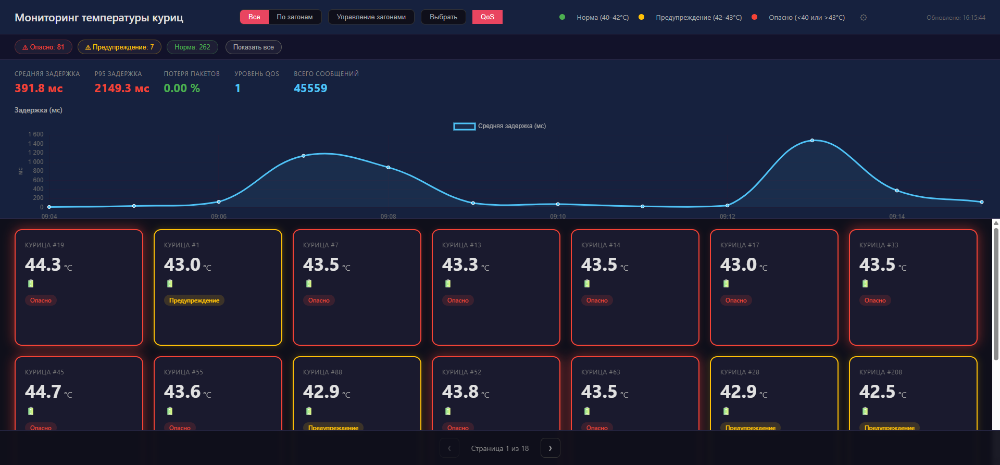

# Chicken Monitor

Chicken Monitor - IoT-система мониторинга телеметрии датчиков через MQTT.
Проект принимает температуру и напряжение питания от датчиков или программного
эмулятора, сохраняет данные, показывает состояние объектов на web-панели и
считает метрики качества доставки сообщений.

Проект сделан как экспериментальный стенд: в нем можно менять MQTT QoS,
имитировать поток от сотен датчиков, смотреть задержки, p95 latency и потери
сообщений по `seq_id`.



## Что показывает проект

- прием телеметрии от IoT-датчиков через MQTT;
- backend API на FastAPI;
- хранение текущих значений и истории измерений;
- web-панель мониторинга с автообновлением;
- группировку объектов по загонам;
- графики температуры за разные периоды;
- расчет задержки доставки, p95 latency и packet loss;
- сравнение MQTT QoS 0, 1 и 2;
- Docker Compose стенд с PostgreSQL, Mosquitto, backend и эмулятором датчиков;
- нагрузочные эксперименты на 200-400 датчиков.

## Стек

- Python, FastAPI, SQLAlchemy
- PostgreSQL
- MQTT, Mosquitto, paho-mqtt
- HTML, CSS, JavaScript, Chart.js
- Docker, Docker Compose
- PowerShell и shell-скрипты для запуска стенда

## Архитектура

```text
Датчики или эмулятор
        |
        | MQTT: ThermoChicken/<id>/Temperature, ThermoChicken/<id>/voltage
        v
Mosquitto MQTT broker
        |
        v
FastAPI backend
        |
        +--> PostgreSQL: текущие значения, история, агрегаты, QoS-метрики
        |
        v
Web dashboard: карточки, группы, графики, QoS-панель
```

Backend принимает два типа сообщений:

- JSON с `value`, `sent_ts`, `seq_id` - основной формат для метрик задержки и потерь;
- одно число - legacy-формат для простых датчиков.

## Основные функции

- Цветовая индикация температуры:
  - зеленый - температура в норме;
  - желтый - повышенная температура;
  - красный - опасное значение;
  - серый - актуального значения пока нет.
- Сортировка карточек по срочности: красные, желтые, серые, зеленые.
- Фильтрация по статусу.
- Режим просмотра всех объектов или группировка по загонам.
- Массовое назначение объектов в загон.
- Графики температуры за 1 час, 6 часов, 24 часа, 7 дней, 30 дней, 6 месяцев и 1 год.
- Агрегация истории для длинных периодов.
- QoS-панель с задержкой, p95, потерями и количеством сообщений.
- Программный эмулятор датчиков для локального стенда.

## Нагрузочные эксперименты

Сводка экспериментов лежит в [experiments/results.md](experiments/results.md).

В дополнительной серии от 31.05.2026 проверялась граница между 100 и 500
датчиками. Условия: QoS 1, интервал отправки 5 секунд, без искусственных потерь,
продолжительность каждого прогона 10 минут.

| Датчиков | QoS | Avg, мс | p95, мс | Потери, % | Сообщений |
|---:|---:|---:|---:|---:|---:|
| 200 | 1 | 42.91 | 82.81 | 0.00 | 24544 |
| 300 | 1 | 637.98 | 3442.91 | 0.00 | 36532 |
| 350 | 1 | 410.64 | 2227.62 | 0.00 | 42562 |
| 400 | 1 | 6641.42 | 7663.55 | 1.02 | 47287 |

Вывод по этой серии: в условиях локального стенда последней устойчивой точкой
были 350 датчиков. При 400 датчиках p95 превысил период отправки телеметрии
5 секунд, появились прикладные потери около 1%.

## Структура репозитория

```text
backend/       FastAPI backend, MQTT client, модели БД, агрегация истории
frontend/      Web-интерфейс мониторинга
emulator/      Эмулятор MQTT-датчиков
mosquitto/     Конфигурация локального MQTT-брокера
experiments/   Результаты и скриншоты экспериментов
docker-compose.yml
docker-compose.override.yml
setup.ps1
setup.sh
```

## Быстрый запуск локального стенда

Нужен Docker Desktop или Docker Engine с Docker Compose.

1. Склонируйте репозиторий:

```powershell
git clone https://github.com/kapitanoff/VKR_C.git
cd VKR_C
```

2. Создайте `.env` для локального стенда:

```dotenv
MQTT_HOST=mosquitto
MQTT_PORT=1883
MQTT_USERNAME=chicken
MQTT_PASSWORD=chicken
MQTT_QOS=1

POSTGRES_USER=chicken
POSTGRES_PASSWORD=chicken123
POSTGRES_DB=chicken_monitor

EMU_SENSORS=10
EMU_QOS=1
EMU_INTERVAL=5
EMU_LOSS=0

TEMP_GREEN_MIN=40.0
TEMP_GREEN_MAX=42.0
TEMP_YELLOW_MAX=43.0
```

3. Создайте файл паролей для локального Mosquitto.

PowerShell:

```powershell
docker run --rm -v "$($PWD.Path)\mosquitto:/mosquitto/config" eclipse-mosquitto:2 mosquitto_passwd -b /mosquitto/config/password.txt chicken chicken
```

Linux / Mac:

```bash
docker run --rm -v "$PWD/mosquitto:/mosquitto/config" eclipse-mosquitto:2 mosquitto_passwd -b /mosquitto/config/password.txt chicken chicken
```

Файл `mosquitto/password.txt` не хранится в Git, потому что содержит пароль.

4. Запустите стенд:

```powershell
docker compose --profile emulator up -d --build
```

5. Откройте интерфейс:

```text
http://localhost:8000
```

Если профиль `emulator` включен, карточки появятся автоматически.

## Подключение к внешнему MQTT-брокеру

Если брокер и реальные датчики уже существуют отдельно, можно использовать
интерактивный setup-скрипт.

Windows:

```powershell
.\setup.ps1
```

Linux / Mac:

```bash
./setup.sh
```

Скрипт создаст `.env`, попросит адрес MQTT-брокера, порт, логин, пароль и
пороговые значения температуры. После этого он может сразу запустить backend и
PostgreSQL через Docker Compose.

Важно: если MQTT-брокер работает на том же компьютере, но вне Docker, внутри
контейнера адрес `localhost` будет указывать на сам контейнер. На Windows и Mac
обычно используйте `host.docker.internal`, на Linux - сетевой адрес хоста.

## Формат MQTT-сообщений

Топик температуры:

```text
ThermoChicken/<номер_датчика>/Temperature
```

Топик напряжения батареи:

```text
ThermoChicken/<номер_датчика>/voltage
```

Основной JSON-формат:

```json
{
  "value": 41.2,
  "sent_ts": 1711464000.123,
  "seq_id": 42
}
```

Поля:

- `value` - измеренное значение;
- `sent_ts` - время отправки сообщения в Unix timestamp;
- `seq_id` - порядковый номер сообщения от датчика.

Для простых датчиков backend также принимает сообщение в виде одного числа:

```text
41.2
```

## Настройки `.env`

| Переменная | Назначение | Пример |
|---|---|---|
| `MQTT_HOST` | Адрес MQTT-брокера | `mosquitto`, `192.168.1.50`, `host.docker.internal` |
| `MQTT_PORT` | Порт MQTT-брокера | `1883` |
| `MQTT_USERNAME` | Логин MQTT | `chicken` |
| `MQTT_PASSWORD` | Пароль MQTT | `chicken` |
| `MQTT_QOS` | Уровень MQTT QoS | `0`, `1`, `2` |
| `POSTGRES_USER` | Пользователь PostgreSQL | `chicken` |
| `POSTGRES_PASSWORD` | Пароль PostgreSQL | `chicken123` |
| `POSTGRES_DB` | База данных | `chicken_monitor` |
| `EMU_SENSORS` | Количество эмулируемых датчиков | `10` |
| `EMU_QOS` | QoS эмулятора | `1` |
| `EMU_INTERVAL` | Интервал отправки, секунд | `5` |
| `EMU_LOSS` | Вероятность прикладной потери | `0`, `0.05`, `0.1` |
| `TEMP_GREEN_MIN` | Нижняя граница нормы | `40.0` |
| `TEMP_GREEN_MAX` | Верхняя граница нормы | `42.0` |
| `TEMP_YELLOW_MAX` | Верхняя граница предупреждения | `43.0` |

После изменения `.env` перезапустите контейнеры:

```powershell
docker compose down
docker compose --profile emulator up -d
```

## Управление стендом

Остановить контейнеры без удаления данных:

```powershell
docker compose down
```

Запустить снова:

```powershell
docker compose up -d
```

Запустить с эмулятором:

```powershell
docker compose --profile emulator up -d
```

Удалить данные PostgreSQL и Mosquitto:

```powershell
docker compose --profile emulator down -v
```

## Диагностика

Проверить состояние контейнеров:

```powershell
docker compose ps
```

Посмотреть логи backend:

```powershell
docker compose logs backend
```

Посмотреть логи эмулятора:

```powershell
docker compose logs emulator
```

Если страница `http://localhost:8000` не открывается:

- проверьте, что Docker запущен;
- проверьте `docker compose ps`;
- посмотрите `docker compose logs backend`;
- убедитесь, что порт `8000` не занят другим приложением.

Если карточки не появляются:

- для локального стенда проверьте `MQTT_HOST=mosquitto`;
- проверьте, что создан `mosquitto/password.txt`;
- проверьте совпадение `MQTT_USERNAME` и `MQTT_PASSWORD` в `.env` и файле паролей Mosquitto;
- для внешнего брокера проверьте сетевой адрес, доступный из контейнера backend;
- убедитесь, что датчики публикуют сообщения в нужные топики.

## Что можно развивать дальше

- вынести frontend в отдельную сборку;
- добавить авторизацию пользователей;
- добавить экспорт отчетов по температуре и потерям;
- добавить автоматическое выявление аномалий по временным рядам;
- оптимизировать прием MQTT-сообщений для больших нагрузок;
- добавить тесты API и сценариев обработки MQTT payload.
